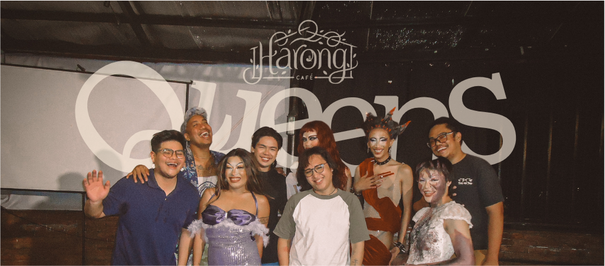

*A Drag and Human Rights Education Project*

Harong Queens is a bold and colorful initiative under TST (Teatro Tao sa Tao) that uses **drag performance as protest**, education, and celebration.  

In a rural setting where queerness is often hidden or dismissed, Harong Queens creates space—both literal and symbolic—for LGBTQ+ expression to flourish. It’s a runway, a classroom, and a protest line all at once. Here, wigs, glitter, and heels become tools for education and transformation.  
  
  
  
Workshops on gender justice, SOGIE rights, and HIV awareness are integrated into each drag show. Between lip syncs and costume reveals, audiences are introduced to critical issues through performance-based pedagogy. Drag is not entertainment alone—it’s resistance.  

Beyond the stage, Harong Queens empowers trans youth to lead. Participants learn not just how to perform, but how to organize. They facilitate dialogues in schools, churches, and barangays. They write their own narratives, respond to online hate, and build solidarity across identities.  

The project is as joyful as it is radical. It teaches that pride is political, that beauty can be defiance, and that transformation doesn’t just happen onstage—it happens when a community sees itself, maybe for the first time, and believes it deserves to be loved.  

