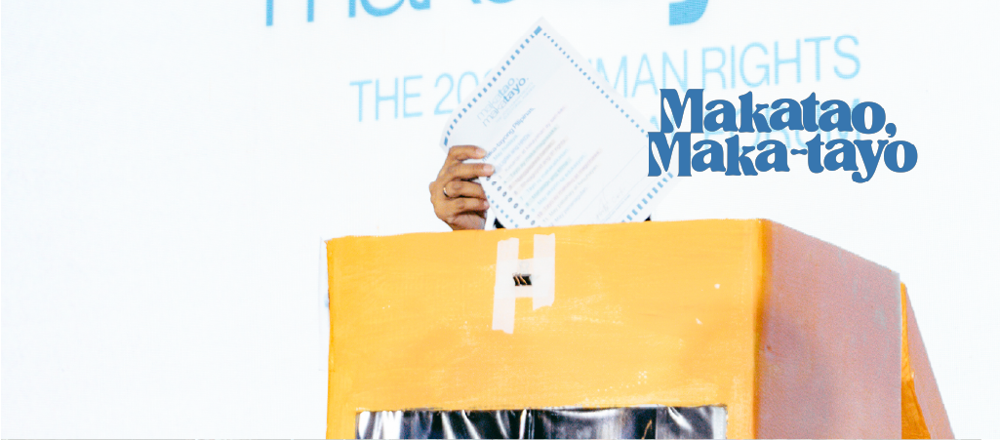

# Makatao, Maka-Tayo Campaign
*Legislative Agenda for Human Rights*  

Makatao, Maka-Tayo is more than a policy document—it is a collective vision of a just and democratic future. Crafted by 18 civil society organizations, this 12-point legislative agenda confronts urgent issues from political repression to labor exploitation, indigenous rights to digital freedoms.  

Each point is rooted in grassroots consultation. Farmers, teachers, students, and workers all contributed to shaping the priorities. From freedom of information to prison reform, the campaign dares to imagine a society where laws serve people, not power.  

  
  
But the campaign is not just about lobbying—it’s about mobilizing. Through forums, teach-ins, and social media, it calls on citizens to engage, to ask: *Who represents us? What do they fight for? What should they be accountable to?*  

In the lead-up to the national elections, Makatao, Maka-Tayo has become a tool for voter education and civic participation. It equips people with questions to ask their candidates, and with language to demand better.  

The campaign is grounded in hope—not blind optimism, but radical hope rooted in collective action. It insists: we can legislate justice, we can build systems that protect the vulnerable, we can choose leaders who serve with integrity. But we must begin with a stand.  

