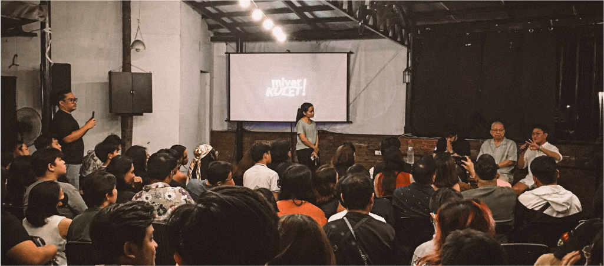

# MiyerKulet!
*Human Rights Film Festival*  
  
MiyerKULET!, a regular cultural event which HRPEC has mounted over two hundred times, is a safe space for the arts and human rights discourse. Every Wednesday, this event invites filmmakers, theater practitioners, and musicians to promote human rights through their art. It allows participants to converse freely on social issues and discuss strategies to further their advocacy in their own spaces.  
  

In 2025, a special edition of MiyerKULET! will be presented as a two-day film festival in addition to its weekly screenings. The festival will accommodate larger audiences, featuring curated films and a contest segment where newer filmmakers can showcase their work. This weekend event aims to celebrate and promote cinema as a medium to advocate for human rights.  
