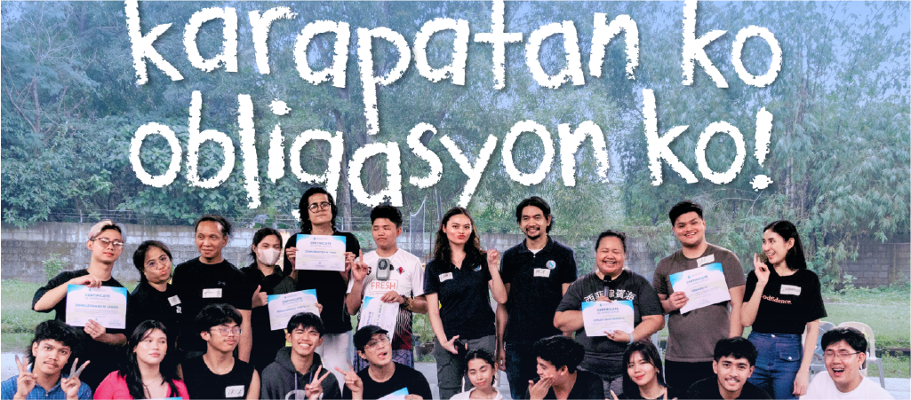

*A Theater and Community Workshop on Rights Education*  

Karapatan ko, Obligasyon ko is a theater-based workshop program that travels into communities often left behind by traditional legal education. Its core philosophy is that knowing your rights should not require formal schooling or legal jargon—it should be a living, breathing part of everyday life.  

In each barangay or campus it visits, the workshop uses improvisation, storytelling, and movement to help participants reflect on injustice, conflict, and power. Community members are invited to share real experiences—of abuse, discrimination, or neglect—and these stories are transformed into short plays performed by the participants themselves.  

The result is raw and powerful. In one town, a mother reenacted her son’s experience of illegal arrest. In another, a student staged a scene of teacher harassment. These stories don’t need scripts; they only need space.  

Facilitators guide the audience through a process of reflection and action planning. What does justice look like here? What can we do now? Through these sessions, the project reminds people that human rights begin with recognition—and responsibility.  

More than just a workshop, Karapatan ko, Obligasyon ko builds networks of grassroots advocates. It affirms that everyone—not just lawyers or activists—has the right and the duty to uphold human dignity in their communities.  

