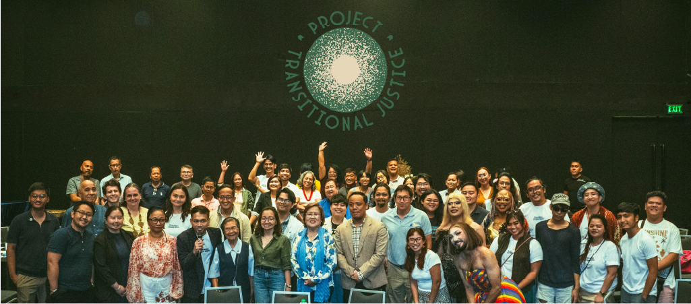

*Interactive Human Rights Film Screenings and Youth Campaign Building for Transitional Justice*

Project Transitional Justice brings together communities through the medium of film and youth-led initiatives. The project focuses on justice for human rights violations by using storytelling and advocacy to unpack state violence, impunity, and collective memory.  

Participants engage in curated film screenings followed by open forums and workshops that equip young people with tools for organizing, campaigning, and building solidarity across sectors. The goal is to turn passive viewers into active human rights defenders.  

  

The program centers the stories of victims, survivors, and communities historically silenced in public narratives. By revisiting the past through cinema and discussion, it urges collective responsibility in shaping a more just future. Films shown range from independent shorts to documentaries, followed by facilitated dialogue where youth critically reflect on history and memory.  

This isn’t just about watching films—it’s about witnessing. It’s about giving space to grief and rage, and transforming them into action. In a country where state narratives often erase systemic abuse, this project reclaims the archive. It tells young people: your memory is valid, your resistance matters.  

